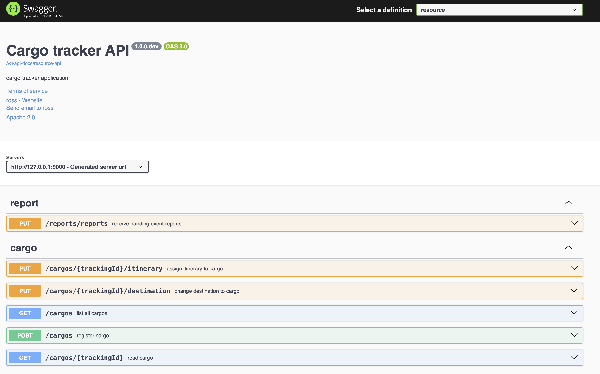

# DDDSample 

## How to build

```shell
cd ./cargotracker
./mvnw spring-boot:run
```

## Domain architecture


## Open API

Stat up the application and open http://127.0.0.1:9000/swagger-ui/index.html, and you will see:


